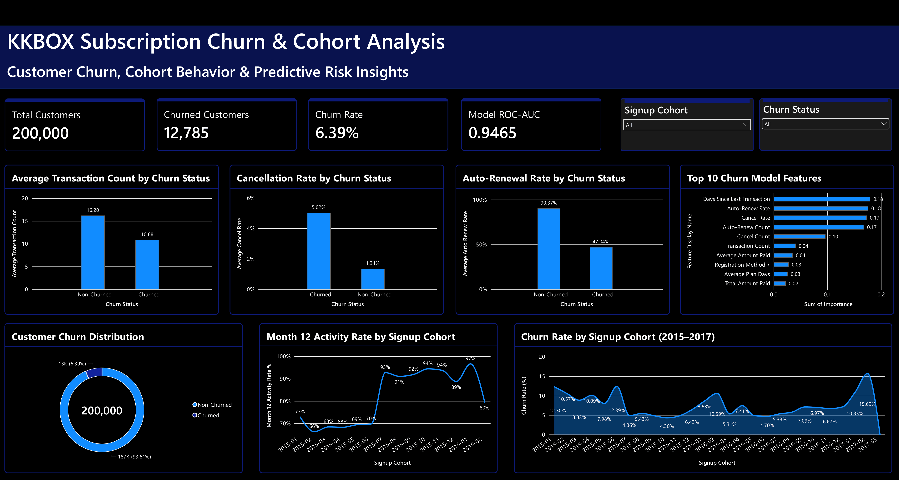

# KKBOX Subscription Churn & Cohort Retention Analysis

A batch data analytics and machine learning project that analyzes customer subscription behavior, cohort activity, and churn for a music streaming business using the KKBOX dataset.

The project combines data engineering, SQL analytics, cohort analysis, feature engineering, machine learning, MLflow experiment tracking, and Power BI visualization in Databricks.

---

## Project Links

- **GitHub Repository:** https://github.com/saiprakash-db/subscription-churn-prediction-databricks
- **Dataset:** https://www.kaggle.com/competitions/kkbox-churn-prediction-challenge
- **Dashboard:** [Dashboard Preview](#dashboard-preview)

---

## Project Documentation

The project documentation and supporting analysis are available in the GitHub repository.

<<<<<<< Updated upstream
- [Business Insights](./docs/business_insights.md)
- [Data Validation SQL](./sql/data_validation.sql)
- [Business Analysis SQL](./sql/business_analysis.sql)
- [Power BI Dashboard](./docs/kkbox_dashboard.png)

---

## Project Notebooks

The project was developed using Python and PySpark notebooks in Databricks. The notebooks are also maintained in the GitHub repository.

1. [01 — Create Customer Scope](https://github.com/saiprakash-db/subscription-churn-prediction-databricks/blob/main/notebooks/01_create_customer_scope.ipynb)
2. [02 — Clean Members](https://github.com/saiprakash-db/subscription-churn-prediction-databricks/blob/main/notebooks/02_clean_members.ipynb)
3. [03 — Process User Logs](https://github.com/saiprakash-db/subscription-churn-prediction-databricks/blob/main/notebooks/03_process_user_logs.ipynb)
4. [04 — Feature Engineering](https://github.com/saiprakash-db/subscription-churn-prediction-databricks/blob/main/notebooks/04_feature_engineering.ipynb)
5. [05 — Temporal Leakage Audit](https://github.com/saiprakash-db/subscription-churn-prediction-databricks/blob/main/notebooks/05_temporal_leakage_audit.ipynb)
6. [06 — Build ML Dataset](https://github.com/saiprakash-db/subscription-churn-prediction-databricks/blob/main/notebooks/06_build_ml_dataset.ipynb)
7. [07 — Cohort Retention Analysis](https://github.com/saiprakash-db/subscription-churn-prediction-databricks/blob/main/notebooks/07_cohort_retention_analysis.ipynb)
8. [08 — Train Churn Model](https://github.com/saiprakash-db/subscription-churn-prediction-databricks/blob/main/notebooks/08_train_churn_model.ipynb)
9. [09 — Model Evaluation & MLflow](https://github.com/saiprakash-db/subscription-churn-prediction-databricks/blob/main/notebooks/09_model_evaluation_mlflow.ipynb)
10. [10 — Business Insights](https://github.com/saiprakash-db/subscription-churn-prediction-databricks/blob/main/notebooks/10_business_insights.ipynb)

> These links point to the project files stored in GitHub and represent the notebooks used in the Databricks batch pipeline.

---

## Business Problem

Subscription businesses need to understand:

- Why customers stop renewing
- Which subscription behaviors are associated with churn
- How churn varies across customer signup cohorts
- Which customer behaviors can help identify higher-risk customers
- What actions can be taken to improve customer retention

This project focuses on three main business questions:

1. How does customer churn and activity vary across signup cohorts?
2. Which subscription and transaction behaviors are associated with churn?
3. Can machine learning identify customers with higher churn risk?

The analysis is designed as an **automated batch pipeline**, not a real-time prediction system.

---

## Project Objectives

- Build a reliable analytical customer scope from the KKBOX dataset
- Clean and validate subscription and member data
- Process historical transaction data
- Perform temporal leakage auditing
- Create leakage-safe customer-level features
- Analyze cohort activity and churn
- Identify behavioral patterns associated with churn
- Train and evaluate churn prediction models
- Track model experiments using MLflow
- Create business-focused Power BI visualizations
- Translate analytical and machine learning results into business recommendations

---

## Tech Stack

- **Databricks Free Edition**
- **Python**
- **PySpark**
- **SQL**
- **Spark MLlib**
- **MLflow**
- **Delta Lake**
- **Power BI**
- **GitHub**

---

## Dataset

This project uses the **KKBOX Churn Prediction Challenge** dataset.

Source:

https://www.kaggle.com/competitions/kkbox-churn-prediction-challenge

The original dataset contains customer membership, transaction, and user activity information.

Raw dataset files are not stored in this GitHub repository.

---

## Analytical Scope

A deterministic stratified customer scope of **200,000 customers** was created from the original training population while preserving the original churn distribution.

| Customer Status | Customers |
|---|---:|
| Non-Churn | 187,215 |
| Churn | 12,785 |
| **Total** | **200,000** |

**Overall churn rate: 6.39%**

---

## Batch Data Pipeline

The project follows a structured batch-processing workflow:

```text
Raw KKBOX Data
       │
       ▼
Customer Scope Creation
       │
       ▼
Data Cleaning & Validation
       │
       ▼
Transaction Processing
       │
       ▼
Temporal Leakage Audit
       │
       ▼
Feature Engineering
       │
       ├──────────────► Cohort & Activity Analysis
       │
       ▼
Leakage-Safe ML Dataset
       │
       ▼
Churn Model Training
       │
       ▼
Model Evaluation
       │
       ▼
MLflow Experiment Tracking
       │
       ▼
Business Insights
       │
       ▼
Power BI Dashboard

```
---
# Data Preparation

The project includes separate processing stages for:

- Customer scope creation
- Member data cleaning
- Transaction processing
- User-log processing
- Feature engineering
- Data quality validation
- Temporal leakage auditing

## Member Data

The raw member dataset contained invalid and missing age values.

Invalid ages were converted to null during cleaning, while missing demographic information was preserved rather than dropping affected customers.

A `has_member_data` indicator was also created to distinguish customers with and without member records.

Final customer-level handling included:

- Invalid age → null
- Missing/unknown gender → `unknown`
- Missing member records → preserved
- Missing member records identified using `has_member_data`

---

## Transaction Data

The original transaction dataset was audited for:

- Transaction date validity
- Membership expiry dates
- Transactions occurring after expiry
- Customer coverage
- Anomalous timing patterns

The final leakage-safe transaction dataset contained:

**3,172,115 transactions across 200,000 customers.**

---

# Temporal Leakage Prevention

Temporal leakage was treated as a critical part of the machine learning pipeline.

The churn label is associated with the customer's February 2017 membership expiry.

For each customer, transaction records occurring after that customer's label expiry date were excluded from the ML feature set.

Final validation confirmed:

- **200,000 customers**
- **3,172,115 leakage-safe transactions**
- **0 post-expiry transactions**

This ensures that the model features are based only on information available before the churn outcome.

---

# Feature Engineering

Customer-level features were created from historical subscription and transaction behavior.

Examples include:

- Transaction Count
- Total Amount Paid
- Average Amount Paid
- Total Plan Price
- Average Plan Days
- Auto-Renew Count
- Cancellation Count
- Auto-Renew Rate
- Cancellation Rate
- Days Since Last Transaction
- Registration Year
- Registration Month
- Age
- Gender
- Registration Channel

Class weighting was used during model training to account for the imbalance between churned and non-churned customers.

---

# Cohort & Activity Analysis

Customers were grouped into signup cohorts based on their registration month.

The analysis examined:

- Cohort churn rates
- Customer activity over time
- Month 12 activity for cohorts with sufficient history
- Differences between early and later signup cohorts

## Example Cohort Churn Rates

| **Signup Cohort** | **Churn Rate** |
| :---------------- | :------------- |
| 2015-01           | 12.30%         |
| 2015-02           | 10.57%         |
| 2015-03           | 8.83%          |
| 2015-07           | 4.86%          |
| 2015-09           | 4.81%          |
| 2015-10           | 4.30%          |

Among the 2015 cohorts analyzed:

- **2015-01 to 2015-06:** average churn rate of **10.36%**
- **2015-07 to 2015-12:** average churn rate of **5.11%**

This indicates meaningful differences in churn behavior across signup cohorts.

### Important Terminology

The dashboard uses **Month 12 Activity Rate** rather than claiming literal subscription retention.

This metric represents transaction activity among customers in a signup cohort and should not be interpreted as a direct subscription-retention measurement.

---

# Churn Prediction

Two classification models were trained and evaluated:

1. Logistic Regression
2. Random Forest

The models were evaluated using a held-out test set.

## Model Comparison

| **Model**           | **ROC-AUC** | **PR-AUC** | **Precision** | **Recall** | **F1**     |
| :------------------ | :---------- | :--------- | :------------ | :--------- | :--------- |
| Logistic Regression | 0.8845      | 0.3272     | 0.2373        | 0.7720     | 0.3630     |
| **Random Forest**   | **0.9465**  | **0.5666** | **0.3196**    | **0.9137** | **0.4736** |

Random Forest performed better across all reported evaluation metrics and was selected as the stronger model for this project.

---

## Random Forest Confusion Matrix

|                  | **Predicted Non-Churn** | **Predicted Churn** |
| :--------------- | :---------------------- | :------------------ |
| Actual Non-Churn | 32,413                  | 4,939               |
| Actual Churn     | 219                     | 2,320               |

The model identified a large proportion of actual churn customers, reflected by its **0.9137 recall**.

---

# Model Feature Importance

The Random Forest model identified the following features as the strongest contributors to model decisions:

| **Rank** | **Feature**                 |
| :------- | :-------------------------- |
| 1        | Days Since Last Transaction |
| 2        | Auto-Renew Rate             |
| 3        | Cancel Rate                 |
| 4        | Auto-Renew Count            |
| 5        | Cancel Count                |
| 6        | Transaction Count           |
| 7        | Average Amount Paid         |
| 8        | Registered Via              |
| 9        | Average Plan Days           |
| 10       | Total Amount Paid           |

The strongest signals were primarily related to **customer activity and subscription renewal/cancellation behavior**.

Feature importance represents model influence and should not be interpreted as proof of causation.

---

# MLflow Experiment Tracking

MLflow was used to track model experiments.

Experiment:

```text
/Shared/kkbox-churn-model
```
Tracked information includes:

- Model type
- Hyperparameters
- Training/test split
- Class weighting
- ROC-AUC
- PR-AUC
- Precision
- Recall
- F1 score

The trained Random Forest model was also saved to a Databricks Unity Catalog volume.

---

# Power BI Dashboard

A one-page Power BI dashboard was created to present the project's analytical and machine learning results in a business-friendly format.

The dashboard uses a dark professional theme with navy-blue accents and white typography.

## Dashboard Title

**KKBOX Subscription Churn & Cohort Analysis**

### Subtitle

**Customer Churn, Retention Behavior & Predictive Risk Insights**

## Dashboard Components

### KPI Cards

The dashboard presents four key KPIs:

- Total Customers — **200K**
- Churned Customers — **13K**
- Churn Rate — **6.39%**
- Model ROC-AUC — **0.9465**

### Interactive Filters

Two slicers allow users to explore the analysis:

- Signup Cohort
- Churn Status

### Analytical Visuals

The dashboard includes:

- Average Transaction Count by Churn Status
- Cancellation Rate by Churn Status
- Churn Rate by Signup Cohort
- Customer Churn Distribution
- Month 12 Activity Rate by Signup Cohort
- Auto-Renewal Rate by Churn Status
- Top Churn Drivers
- Business Recommendations

### Business Recommendations

The dashboard translates the analysis into actionable recommendations:

1. **Prioritize customers without auto-renewal**

   Customers without auto-renewal had a **31.92% churn rate**, making renewal reminders and retention campaigns a key priority.

2. **Monitor cancellation behavior**

   Customers in the high-cancellation segment had an **82.37% churn rate**, making repeated cancellation activity an important warning signal.

3. **Protect low-risk customers**

   Customers with auto-renewal and no cancellation had only a **0.60% churn rate**. Maintaining a smooth renewal experience is important for this segment.

4. **Focus on recent activity and renewal behavior**

   The strongest Random Forest drivers include **Days Since Last Transaction, Auto-Renew Rate, and Cancel Rate**.
---
## Dashboard Preview

The completed Power BI dashboard is shown below.


---
# Business Insights
---

## 1. Auto-Renewal Is Strongly Associated With Churn

Customers with no auto-renewal had a:

**31.92% churn rate**

Compared with:

**2.95% churn for customers who always auto-renewed.**

### Business Action

Prioritize customers without auto-renewal for:

- Renewal reminders
- Auto-renewal education
- Retention campaigns
- Easier renewal experiences

---

## 2. Cancellation Behavior Is a Strong Warning Signal

Customers in the high-cancellation segment had an:

**82.37% churn rate**

This is a relatively small segment, so the result should be treated as a strong warning signal rather than a causal conclusion.

### Business Action

Use repeated cancellation behavior as an early retention warning signal.

---

## 3. Auto-Renewal + No Cancellation Represents a Low-Churn Segment

Customers with auto-renewal and no cancellations had a:

**0.60% churn rate**

### Business Action

Protect this segment by maintaining a smooth renewal experience and avoiding unnecessary friction.

---

## 4. Recent Activity Is Important

The strongest Random Forest feature was:

**Days Since Last Transaction**

This suggests that recent subscription activity is an important signal in the model.

### Business Action

Use recent customer activity together with renewal and cancellation behavior when designing churn monitoring strategies.

---

# Key Project Results

| **Metric**                         | **Result** |
| :--------------------------------- | :--------- |
| Analytical Customers               | 200,000    |
| Overall Churn Rate                 | 6.39%      |
| Leakage-Safe Transactions          | 3,172,115  |
| Random Forest ROC-AUC              | 0.9465     |
| Random Forest PR-AUC               | 0.5666     |
| Random Forest Recall               | 0.9137     |
| Random Forest F1                   | 0.4736     |
| No Auto-Renewal Churn              | 31.92%     |
| High-Cancellation Churn            | 82.37%     |
| Auto-Renew + No Cancellation Churn | 0.60%      |

---

# Repository Structure

```text
subscription-churn-prediction-databricks/
│
├── README.md
│
├── notebooks/
│   ├── 01_create_customer_scope.ipynb
│   ├── 02_clean_members.ipynb
│   ├── 03_process_user_logs.ipynb
│   ├── 04_feature_engineering.ipynb
│   ├── 05_temporal_leakage_audit.ipynb
│   ├── 06_build_ml_dataset.ipynb
│   ├── 07_cohort_retention_analysis.ipynb
│   ├── 08_train_churn_model.ipynb
│   ├── 09_model_evaluation_mlflow.ipynb
│   └── 10_business_insights.ipynb
│
├── sql/
│   ├── data_validation.sql
│   └── business_analysis.sql
│
├── models/
│
└── docs/
    ├── business_insights.md
    └── kkbox_dashboard.png
```
---
# Project Limitations

- The project uses a deterministic **200,000-customer analytical scope** rather than the complete original training population.
- User-log data was not used as a feature source for the churn ML model because the available extracted user-log file did not provide the required temporal coverage for the February 2017 churn cohort.
- Customer-level churn probability scoring was not included because the exact original training preprocessing pipeline could not be safely reconstructed for full-population scoring.
- Feature importance indicates model influence, not causal relationships.
- The dashboard presents **Month 12 Activity Rate**, which should not be interpreted as literal subscription retention.
- The project is an **automated batch analytics and ML pipeline**, not a real-time prediction system.

---

# Project Status

## Core Analytics, Machine Learning & Dashboard: Complete

Completed:

- [x] Customer scope creation
- [x] Data cleaning
- [x] Transaction processing
- [x] Temporal leakage audit
- [x] Feature engineering
- [x] Leakage-safe ML dataset
- [x] Cohort analysis
- [x] Activity analysis
- [x] Churn prediction
- [x] Model evaluation
- [x] MLflow tracking
- [x] Business insights
- [x] Power BI dashboard
- [x] Dashboard export
- [x] Dashboard image added to repository
- [x] README dashboard preview

---

# Author

**Sai Prakash Lingala**

B.Tech in Artificial Intelligence

**Aspiring Data Analyst | Data Analytics & Engineering | AI | SQL | Python | Power BI | Databricks**

- GitHub: https://github.com/saiprakash-db
- LinkedIn: https://www.linkedin.com/in/sai-prakash-lingala-400854287
